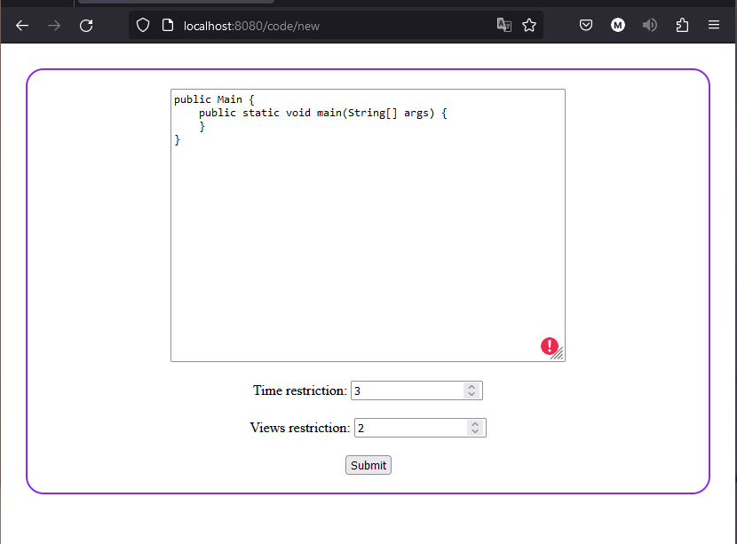
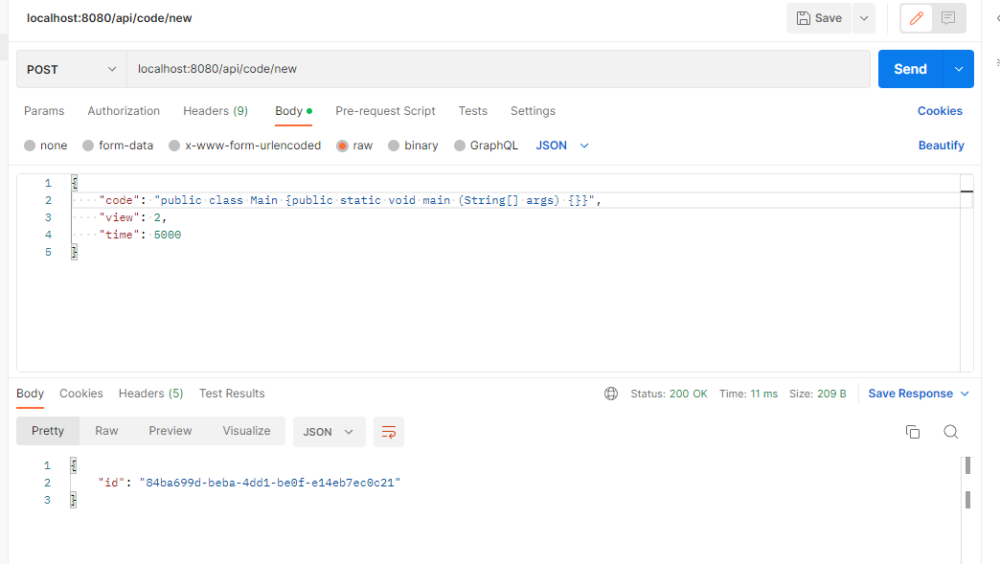
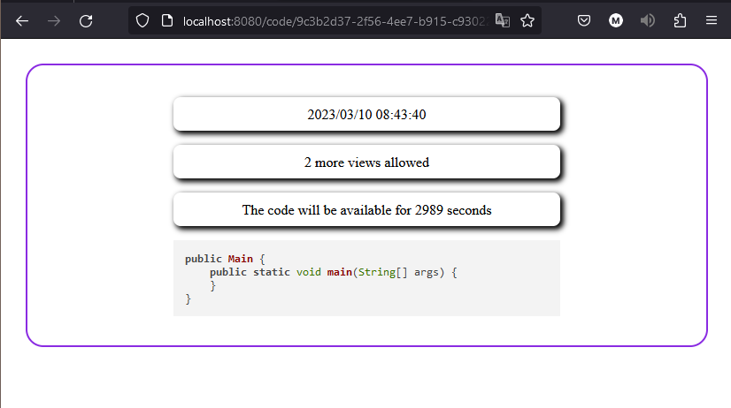
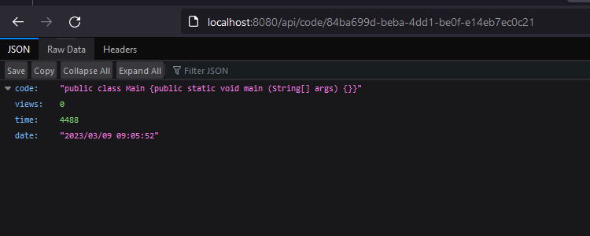
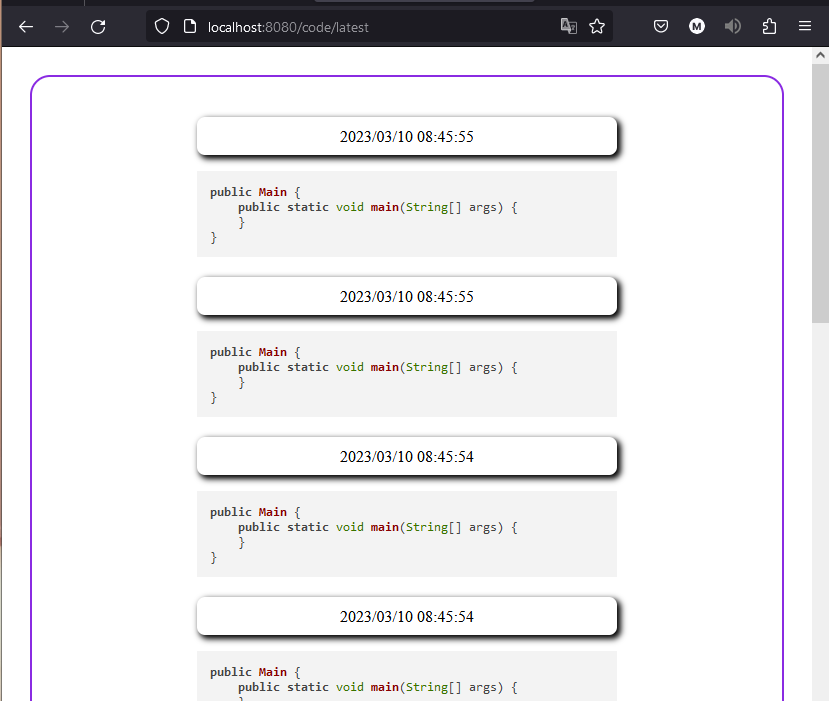
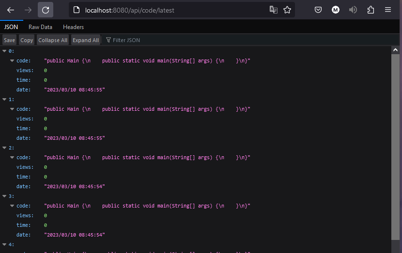

# Code Sharing Platform

A Code Sharing Platform API / Service can be used to share code with all users.
The code sharing platform has two modes, an API and a Service. Both can be used, an API is used with HTML, JavaScript, React etc.. to build the front-end with,
while relying on the API to provide the data.

The platform uses database to store and process data, If the server was shutdown the data persists.
The other mode is using it as is, with minimalistic Web Forum, and Web service that will fetch a ready-made HTML that is generated on the server side and sent to the user browser to render.

Posting a code have two optional parameters to be passed, a timer and views count. Sending requests with no view counts or 0 view counts will make the code public, and will be able to be accessed by anyone with no restrictions and no time to be removed.

Further more using public does will appear in the latest code snippets in the API.

giving code specific view count, or timer will make code not be shown in the public lists, and to share it you will have to provide the code's unique ID.
# Requirement
- Java version 17+ <a href="https://www.oracle.com/de/java/technologies/downloads/">Java download Link</a>

# Build - Run Project
- Clone repository and navigate into repo's directory
- Run project with `$ ./gradlew bootRun`
- Server will be running on port `https://localhost:8080/`

# Stopping the server
To shut down the server use actuator by sending POST request to `https://localhost:8080/actuator/shutdown`

# Controller Service End Points

Default host is `localhost:8080`
The server end point to send http requests on to use the post code forum, and URL for retrieval.
Note: For API end points its explained further bellow this topic.

- `/code/new` is used to post a code to the server, specifying a view or 
- `/code/{id}` is used to retrieve a code by providing an ID replace `{id}` with a proper id as parameter.
- `/code/latest` will retrieve the latest 10 code snippets that have been posted, the code snippets have to be public and have no views, or timer to appear.

# Controller API Service End Points

Default host is `localhost:8080`
the API end points is very similar to the above except we add API keyword to the front of it.

- `POST` endpoint `api/code/new` is used to post new code snippets, the json format is as follows
```json
{
    "code": "public void static main(String[] args) {}",
    "view": 3,
    "time": 2
}
```
view and time is optional as explained in the description above, can be omitted.
- GET `api/code/{id}` is used to get json body that contains the details of the code. further details in the examples bellow.
- GET `api/code/latest` will retrieve a list of last 10 public snippet json.

# Example - Posting Code
- Posting Code using Forum 
- Posting Code API 
- Posting Public Code 

# Example - Getting Code With ID
- Using Service 
- Using API 

# Example - Getting The Latest Public Codes
- Using Service 
- Using API 
